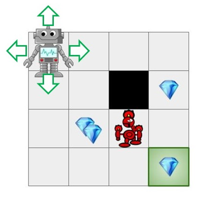
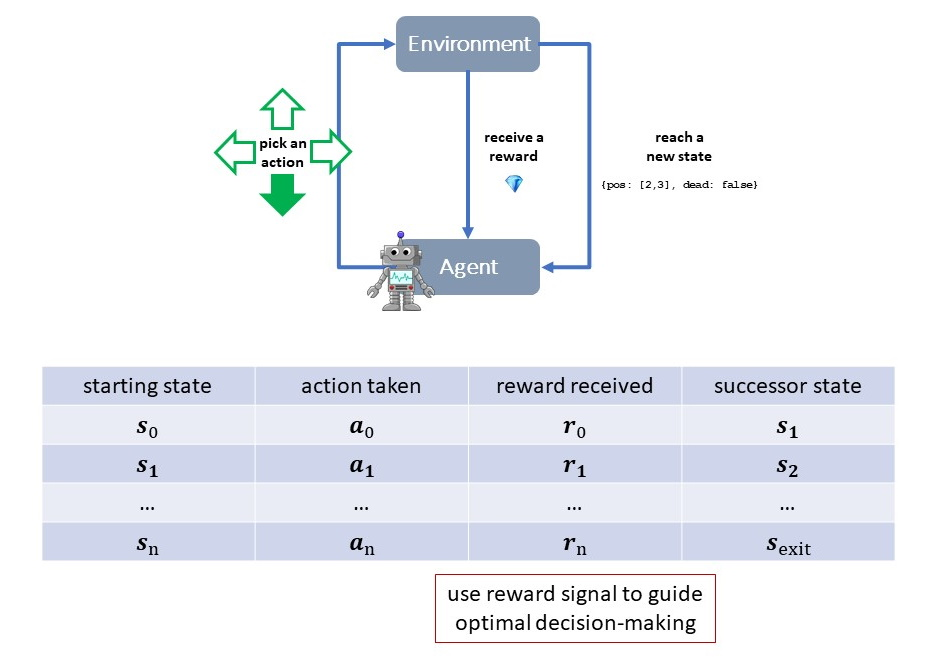
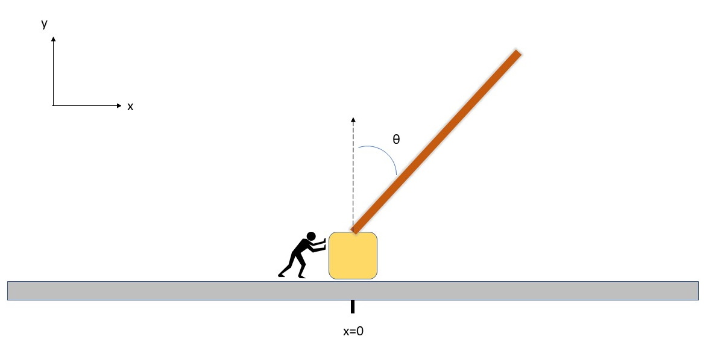
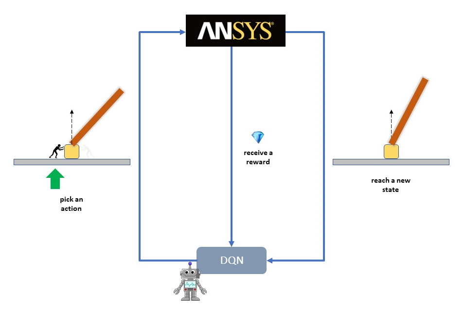
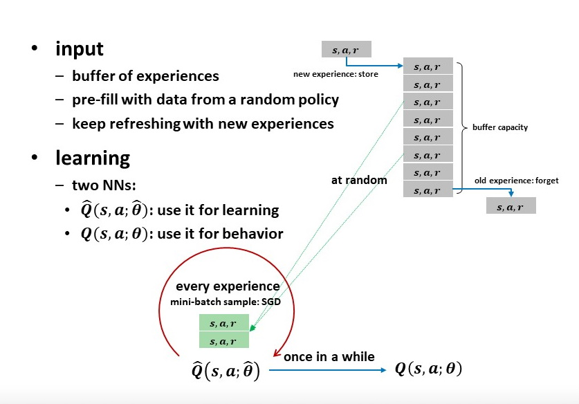
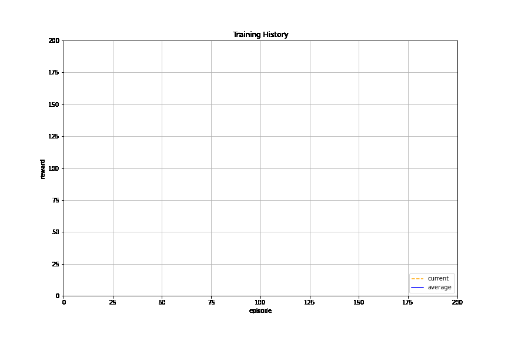

  .. _ref_ml_rl_cartpole:

Reinforcement Machine Learning using PyMAPDL: Cartpole Simulation
=================================================================

This notebook demonstrates a reinforcement machine learning example using MAPDL
through PyMAPDL.

This example assumes you have cloned the `ml-rl-cartpole
<https://github.com/pyansys/ml-rl-cartpole>`_ repository and are in the correct
directory with:

.. code::

   git clone https://github.com/pyansys/ml-rl-cartpole
   cd ml-rl-cartpole

.. code:: ipython3

    # Installing pyansys packages
    !pip install ./pyansys_rl ./pyansys_gym -q --user --use-feature=in-tree-build

.. code:: ipython3

    # Loading requires packages
    import os
    import sys
    import numpy as np
    import matplotlib
    
    import gym
    import pyansys_cartpole
    
    np.set_printoptions(precision=4, suppress=True)
    
    %matplotlib inline

Background: Markov Decision Process
-----------------------------------

   
   Fig 1: Learning agent.

In a Markov Decision Process we have an agent immersed in an
environment. At any given time, the agent finds itself in a state and it
must select one of the available actions. Upon taking an action, the
environment responds by assigning a reward and transitioning the agent to
a successor state. This loop continues until a terminal state is
reached. It is interesting to ask: could we learn to act optimally in
such a setup? could we learn to select sequences of actions that
maximize long term cumulative rewards?

   
   Fig 2: Markov Decision Process in Reinforced Learning

CartPole Simulation
-------------------

The CartPole is a classic control problem. It is a balancing task: push
the cart such that the pinned pole remains upright. In other words, the
pole behaves as a solid inverted pendulum and is unstable about the
desired configuration. A simple implementation could use a
revolute/hinge joint between the cart and the pole, and a translational
joint between the cart and the ground.

   
   Fig 3: Cartpole problem.

MAPDL in the loop
~~~~~~~~~~~~~~~~~

In this implementation of the CartPole as a Markov Decision Process, we
highlight the following components:

-  Actions: push either left (:math:`action = 0`) or right
   (:math:`action = 1`)
-  State:
   :math:`x_{\text{cart}}, v_{\text{cart}}, \theta_{\text{pole}}, v_{\text{pole}}`
-  Reward: +1 for every timestep still in equilibrium
-  Transition Model: courtesy of an MAPDL structural transient analysis

At each episode, the system starts in a randomly seeded state, with
positions, velocities and angles picked from a uniform distribution
about the vertical/resting position, thus it is unlikely to ever be at
equilibrium. Even if it were, the equilibrium would be unstable.

   
   Fig 4: A single iteration of the CartPole as a Markov Decision Process using MAPDL

Instance creation: MAPDL in the loop
~~~~~~~~~~~~~~~~~~~~~~~~~~~~~~~~~~~~

Create an instance of an MAPDL environment that is specially wrapped for
use in `OpenAI Gym <https://gym.openai.com/>`__ thanks to the newly
developed python gRPC bindings
(`PyAnsys <https://github.com/pyansys>`__). The wrapper sets up the
CartPole physics, accepts the available actions (i.e. forces), and
calculates the state transitions (kinematic response) after every time
step (an MAPDL load step).

For reference, OpenAI Gym provides its own ad hoc
`environment <https://gym.openai.com/envs/CartPole-v1/>`__ for solving
the system’s `kinematic
equations <https://github.com/openai/gym/blob/master/gym/envs/classic_control/cartpole.py>`__

.. code:: ipython3

    # Loading environment
    env_name = 'pyansys-CartPole-v0'
    env = gym.make(env_name)
    
    # run several episodes (e.g., 3) of the CartPole using a random action, i.e., sometimes 0 (push left), sometimes 1 (push right)
    n_episodes = 3
    for i in range(n_episodes):
        print('*' * 30, f'Episode: {i+1}', '*' * 30)
        cur_state = env.reset()
        done, r_tot = False, 0
        while not done:
            action = np.random.choice([0, 1])
            next_state, reward, done, info = env.step(action)
            print('State:', cur_state, '\tAction:', '--->' if action else '<---', '\tReward: ', reward)
            cur_state, r_tot = next_state, r_tot + reward
        print('Episode Reward:', r_tot)
        print('')

.. parsed-literal::

    ****************************** Episode: 1 ******************************
    State: [-0.0168  0.045   0.9473  0.    ] 	Action: <--- 	Reward:  1
    State: [-0.0179 -0.1075  1.5645  0.0392] 	Action: ---> 	Reward:  1
    State: [-0.0199 -0.0881  2.6821  0.042 ] 	Action: <--- 	Reward:  1
    State: [-0.0218 -0.1082  3.8081  0.047 ] 	Action: <--- 	Reward:  1
    State: [-0.0259 -0.3035  6.1548  0.132 ] 	Action: ---> 	Reward:  1
    State: [-0.0318 -0.2846  9.4723  0.1304] 	Action: ---> 	Reward:  1
    State: [-0.0356 -0.0901 11.5597  0.0742] 	Action: <--- 	Reward:  1
    Episode Reward: 7
    
    ****************************** Episode: 2 ******************************
    State: [ 0.0162 -0.0124 -1.0163  0.    ] 	Action: ---> 	Reward:  1
    State: [ 0.0173  0.1075 -1.6337  0.0394] 	Action: <--- 	Reward:  1
    State: [ 0.0192  0.0882 -2.7514  0.0425] 	Action: ---> 	Reward:  1
    State: [ 0.0212  0.1083 -3.8778  0.0478] 	Action: <--- 	Reward:  1
    State: [ 0.0231  0.0888 -5.0001  0.0595] 	Action: ---> 	Reward:  1
    State: [ 0.0251  0.1092 -6.1301  0.0614] 	Action: <--- 	Reward:  1
    State: [ 0.0271  0.0897 -7.2555  0.0785] 	Action: <--- 	Reward:  1
    State: [ 0.027  -0.1045 -7.1719  0.0084] 	Action: <--- 	Reward:  1
    State: [ 0.0229 -0.2994 -4.876   0.0446] 	Action: ---> 	Reward:  1
    State: [ 0.0172 -0.2792 -1.5695  0.0351] 	Action: ---> 	Reward:  1
    State: [ 0.0135 -0.0839  0.5111  0.0432] 	Action: <--- 	Reward:  1
    State: [ 0.0116 -0.1032  1.5847  0.0448] 	Action: <--- 	Reward:  1
    State: [ 0.0076 -0.2979  3.8727  0.0274] 	Action: <--- 	Reward:  1
    State: [-0.0003 -0.4931  8.3327  0.0826] 	Action: ---> 	Reward:  1
    Episode Reward: 14
    
    ****************************** Episode: 3 ******************************
    State: [ 0.0363 -0.0121 -0.0026  0.    ] 	Action: <--- 	Reward:  1
    State: [ 0.0352 -0.1074  0.6139  0.0367] 	Action: ---> 	Reward:  1
    State: [ 0.0333 -0.0878  1.7286  0.0349] 	Action: ---> 	Reward:  1
    State: [0.0335 0.1071 1.6179 0.038 ] 	Action: ---> 	Reward:  1
    State: [ 0.0376  0.3024 -0.7279  0.1012] 	Action: <--- 	Reward:  1
    State: [ 0.0434  0.2828 -4.0709  0.1019] 	Action: ---> 	Reward:  1
    State: [ 0.0493  0.3028 -7.3943  0.1046] 	Action: ---> 	Reward:  1
    State: [  0.0573   0.498  -11.8517   0.1887] 	Action: <--- 	Reward:  1
    Episode Reward: 8
    
    

The above results express the actions taken by the agent and the
correpondent rewards and states.

Reinforcement Learning: Deep Q-Network
--------------------------------------

The Deep Q-Network (DQN) implementation is inspired by the famous paper
`Mnih et al, 2014 <https://www.nature.com/articles/nature14236>`__.

| The algorithm consists of two neural networks (NN) to accumulate the
  statistical information about optimal reward sequences. One NN, used
  for learning, is trained at every step by picking a random sample of
  experiences (state, action, reward)-tuples from an “experience
  buffer”.
| The buffer is filled from new experiences (old experiences are retired
  once the contents exceed capacity) as the agent trains.
| At the outset, the buffer is pre-filled with experiences from an agent
  that behaves at random for a fixed number of steps.

   
   Fig 5: Learning buffer.

The other NN, used for behavior, is just a snapshot of the first
refreshed at fixed intervals and dictates what actions to take.

Neural Network Parameters
~~~~~~~~~~~~~~~~~~~~~~~~~

-  Neural network size/topology: [4, 32, 32, 2]

   -  4: for each components of the state
      (:math:`x_{\text{cart}}, v_{\text{cart}}, \theta_{\text{pole}}, v_{\text{pole}}`)
   -  32: hidden layer 1 with 32 ReLU neurons
   -  32: hidden layer 2 with 32 ReLU neurons
   -  2: for each possible action with linear neurons [Left, Right]

-  Neural network refresh rate: every timestep
-  Buffer capacity: 40K experiences
-  Buffer warmup: 1K experiences
-  Sample size: 64 experiences per timestep
-  :math:`\varepsilon`: linear decay from 1 to .05 in 1000 timestep (.05
   thereafter)
-  :math:`\gamma = .99`

Learning Task
~~~~~~~~~~~~~

Try to balance the pole up to 200 steps. Declare success when the
10-episode average exceeds 196

Each learner will display a history of performance per episode, encoded
as follows:

-  e: episode number
-  n: timesteps
-  x: max reward thus far
-  r: reward
-  v: avg reward (e.g., for last 10 steps)
-  vx: max average reward
-  nt: total timesteps thus far

.. code:: ipython3

    # Importing required packages
    from uuid import uuid4
    import tempfile
    import warnings
    warnings.filterwarnings("ignore")
    
    # Importing ML packages
    from pyansys_dqn import dqn, dqn_runner, qn_keras
    import tensorflow as tf
    
    # For plotting
    from pyansys_dqn.dqn_runner import LivePlotter

“Native” OpenAI environment
~~~~~~~~~~~~~~~~~~~~~~~~~~~

Here we take practice swings running reinforcement learning on a known
open source implementation of the classic control problem. You should
see the episode rewards and their running average increase until they
arrive at the training objective (196 for 10-episode average):

.. code:: ipython3

    # Calling OpenAI Cartpole environment and generating folders for backup.
    env_name = 'CartPole-v0'
    tmp_path = tempfile.gettempdir()
    
    output_path_gym = os.path.join(tmp_path, 'gym_cartpole_results', str(uuid4())) 
    output_name_gym = 'gym_cartpole_00'
    
    if not os.path.exists(output_path_gym):
        os.makedirs(output_path_gym)
    print(f'Writing model in: {output_path_gym}')

.. parsed-literal::

    Writing model in: C:\\Users\\gayuso\\AppData\\Local\\Temp\\gym_cartpole_results\\e22e8cab-251d-4d8a-b698-bcc9ac841ac9

Now, let's train the agent.

.. code:: ipython3

    gym_plotter = LivePlotter()
    
    results = dqn_runner.run(env_name,
                             dqn.ClassicDQNLearner,
                             qn_keras.QNetwork,
                             layers=[64, 64],
                             n_episodes=200,
                             epsilon=dqn_runner.basic_epsilon_linear(1, 0.05, 1000),
                             gamma=0.99,
                             n_mini_batch=64,
                             replay_db_warmup=1000,
                             replay_db_capacity=40000,
                             c_cycle=1,
                             polyak_rate=0.99,
                             averaging_window=10,
                             victory_threshold=196,
                             diagnostics_fn=gym_plotter.live_plot,
                             output_path=output_path_gym,
                             output_name=output_name_gym)
    

PyAnsys in OpenAI environment
~~~~~~~~~~~~~~~~~~~~~~~~~~~~~

Now we do reinforcement learning with MAPDL in the loop as an OpenAI Gym
package, thanks to the PyAnsys API.

   
   Fig 6: A single iteration of the CartPole as a Markov Decision Process using MAPDL in pyansys

In this environment, MAPDL will provide the environment response after
solving.

.. code:: ipython3

    # Calling PyAnsys Cartpole environment and generating folders for backup.
    import pyansys_cartpole
    
    env_name = 'pyansys-CartPole-v0'
    tmp_path = tempfile.gettempdir()
    
    output_path_pyansys = os.path.join(tmp_path, 'pyansys_cartpole_results', str(uuid4())) 
    output_name_pyansys = 'pyansys_cartpole_00'
    
    if not os.path.exists(output_path_pyansys):
        os.makedirs(output_path_pyansys)
    print(f'Writing model in: {output_path_pyansys}')

.. parsed-literal::

    Writing model in: C:\\Users\\gayuso\\AppData\\Local\\Temp\\pyansys_cartpole_results\\6c1d4342-1563-4513-a834-9f94bfcc29ab
    

We train the learner:

.. code:: ipython3

    pyansys_plotter = LivePlotter()
    
    results2 = dqn_runner.run(env_name,
                             dqn.ClassicDQNLearner,
                             qn_keras.QNetwork,
                             layers=[32, 32],
                             n_episodes=5000,
                             epsilon=dqn_runner.basic_epsilon_linear(1, 0.05, 1000),
                             gamma=0.99,
                             n_mini_batch=64,
                             replay_db_warmup=1000,
                             replay_db_capacity=40000,
                             c_cycle=1,
                             polyak_rate=0.99,
                             averaging_window=10,
                             victory_threshold=196,
                             diagnostics_fn=pyansys_plotter.live_plot,
                             output_path=output_path_pyansys,
                             output_name=output_name_pyansys)

The learner is trained successfully.

Random Agent
~~~~~~~~~~~~

For comparison, here we create a simple test agent that behaves randomly
and thus is not likely to succeed at the balancing task.

.. code:: ipython3

    # Importing required packages
    from pyansys_dqn.test_agents import RandomAgent, TrainedAgent

    env_name = 'pyansys-CartPole-v0'
    env = gym.make(env_name)
    
    agent = RandomAgent(env.action_space.n)
    
    s = env.reset()
    
    labels = ["Cart position", "Cart velocity", "Theta angle", "Pole velocity"]
    
    print(" - ".join([each.center(20) for each in labels]))
    print(" - ".join([ f"{each:6.3}".center(20) for each in s]))
    

.. parsed-literal::

       Cart position     -    Cart velocity     -     Theta angle      -    Pole velocity    
          -0.00706       -         0.033        -          2.18        -           0.0       
    

Below, notice how we inform the agent about each state transition with
``agent.start_state(s)`` or ``agent.next_reading(s, r, done)`` and then
ask it to recommend an action with ``agent.next_action()``. We inform
the environment this recommendation by feeding the method
``env.step(a)``. We do not expect these recommendations to be good
because this agent selects at random from the choices ‘left’ and
‘right’, with equal probability. A control algorithm that just flips a
coin to select how to behave is usually not effective. Thus, the pole
should not stay balanced for long.

.. code:: ipython3

    agent.start_state(s)
    done, r_tot = False, 0
    
    print("Action - " + " - ".join([each.center(20) for each in labels]))
    
    while not done:
        a = agent.next_action()
        s, r, done, _ = env.step(a)
        agent.next_reading(s, r, done, False)
        print('--->' if a else '<--- ', ' - ', " - ".join([ f"{each:6.3}".center(20) for each in s]))
        r_tot += r
    
    print('\nTotal timesteps:', r_tot+1)
    print(f'Final theta angle: {s[2]:4.2f} degrees')

.. parsed-literal::

    Action -    Cart position     -    Cart velocity     -     Theta angle      -    Pole velocity    
    --->  -        -0.0214        -        0.0491        -        0.0498        -          3.29       
    
    Total timesteps: 2
    Final theta angle: 0.05 degrees
    

As we see the theta in the last reported state (last row, third column),
theta exceed the 12 degrees maximum, hence the simulation is stopped.

Reusing trained agent
---------------------

Now we create an agent that has been trained, i.e., that refers to a
successful neural networks in order to decide how best to act. It is
thus much more likely to perform well and balance the pole for a
noticeably greater number of steps… all this despite having a random
starting point for the system!

.. code:: ipython3

    n_actions = 2
    agent = TrainedAgent(output_path_pyansys, output_name_pyansys, env.action_space.n, env.observation_space.shape)

    s = env.reset()
    print(" - ".join([each.center(20) for each in labels]))
    print(" - ".join([ f"{each:6.3}".center(20) for each in s]))

.. parsed-literal::

       Cart position     -    Cart velocity     -     Theta angle      -    Pole velocity    
           -0.039        -        0.0487        -        -0.569        -           0.0       
    

Below, notice how we inform the agent about each state transition with
``agent.start_state(s)`` or ``agent.next_reading(s, r, done)`` and then
ask it to recommend an action with ``agent.next_action()``. We follow
its recommendation by feeding it into the environment in
``env.step(a)``. The recommendations should be pretty good because they
stem from neural networks that store the information resulting from
successful training and the pole should stay up longer, hopefully for
the entirety of the episode (200 steps).

.. code:: ipython3

    agent.start_state(s)
    done, r_tot = False, 0
    
    # print("Action - " + " - ".join([each.center(20) for each in labels])) # Uncomment to print each step
    
    while not done:
        a = agent.next_action()
        s, r, done, _ = env.step(a)
        agent.next_reading(s, r, done, False)
        # print('---> ' if a else '<--- ', ' - ', " - ".join([ f"{each:6.3}".center(20) for each in s])) # Uncomment to print each step
        r_tot += r
    
    print(" - ".join([each.center(20) for each in labels]))
    print(" - ".join([ f"{each:6.3}".center(20) for each in s]))
    print('\nTotal timesteps:', r_tot+1)
    print(f'Final theta angle: {s[2]:4.2f} degrees')

.. parsed-literal::

       Cart position     -    Cart velocity     -     Theta angle      -    Pole velocity    
          -0.0392        -         0.105        -        -0.464        -         0.549       
    
    Total timesteps: 201
    Final theta angle: -0.46 degrees
    

We are just printing the last time step.

Epilogue
--------

Try resuming a trained neural network of your own!

References
----------

-  `The DQN Agent - TensofFlow.org <https://www.tensorflow.org/agents/tutorials/0_intro_rl#the_dqn_agent>`_
   
-  `Human-level control through deep reinforcement learning - V Mnih et al. <https://www.nature.com/articles/nature14236>`_
